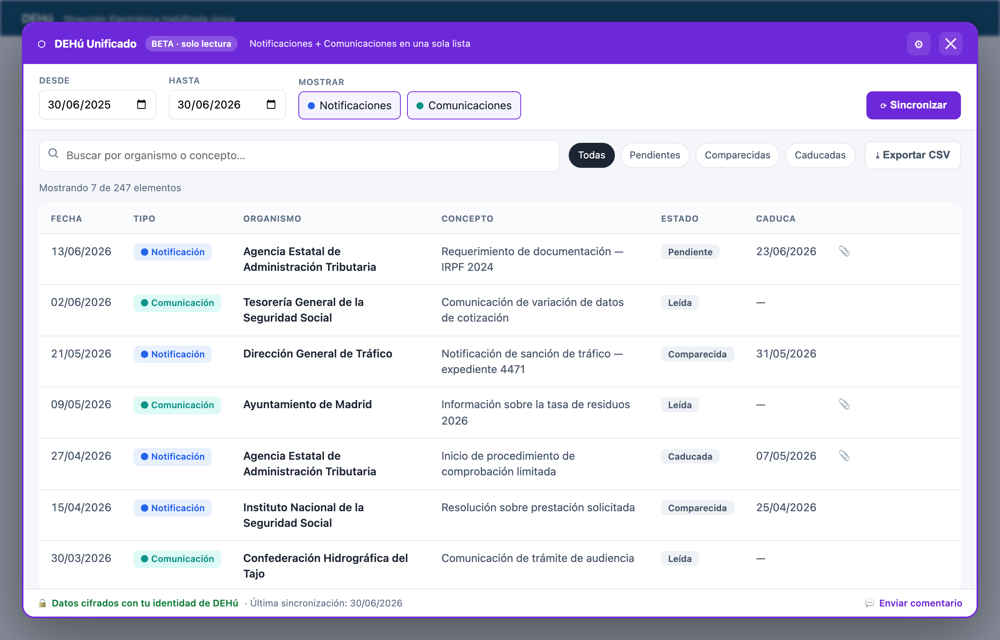

# DEHú Unificado

> ⚠️ Versión beta.

Extensión de navegador que reúne tus **Notificaciones** y **Comunicaciones** de [DEHú](https://dehu.redsara.es) en **una sola lista buscable**, sin el límite de 30 días del buscador oficial.



> Captura con datos de ejemplo.

## Privacidad

Solo lectura: nunca abre una notificación ni provoca una *comparecencia*; cada fila enlaza a la página oficial. Tus datos se guardan **cifrados en tu equipo** y no salen de él; puedes borrarlos cuando quieras. Herramienta **no oficial**. Detalles en la [política de privacidad](./PRIVACY.md).

## Instalar

Próximamente en la **Chrome Web Store** y en **Firefox Add-ons** (aquí irá el enlace al publicarse).

Mientras tanto puedes instalar la beta manualmente (ver [Desarrollo](#desarrollo)).

## Enviar comentarios

¿Un fallo o una idea? Pulsa **«💬 Enviar comentario»** en la extensión, o [abre una incidencia](https://github.com/jdvivar/dehu-lista-unificada/issues/new). Necesitas una cuenta gratuita de GitHub.

## Origen

La idea surgió de [este hilo de Jaime Obregón](https://x.com/JaimeObregon/status/2071517569790402776) sobre los dos buzones separados y el límite de 30 días de DEHú.

## Desarrollo

```bash
npm install && npm run build
npm test
```

Carga la raíz del repositorio (o el zip de la última [release](https://github.com/jdvivar/dehu-lista-unificada/releases)) como extensión descomprimida: página de extensiones → *Modo de desarrollador* → *Cargar descomprimida*.

## Licencia

[GPL-3.0-or-later](./LICENSE)
